# 💈 Markus Barbería - Sistema de Reservas y Gestión Multinivel

  

 

Un sistema integral (B2C y B2B) desarrollado desde cero para automatizar y gestionar la operación de una cadena de barberías con **3 sedes físicas**. Este proyecto resuelve el problema de las colisiones de horarios mediante un motor de disponibilidad dinámica y sincronización en tiempo real.

---

## 🛠️ Stack Tecnológico

- **Frontend:** Next.js, React, TypeScript.
- **Estilos:** Tailwind CSS (Diseño UI/UX oscuro y minimalista).
- **Backend & Base de Datos:** Supabase (PostgreSQL).
- **Autenticación & Seguridad:** Supabase Auth, Row Level Security (RLS), Next.js Middleware.
- **Realtime:** Supabase WebSockets.
- **Despliegue:** Vercel.

---

## 📱 1. Vista Cliente (Frontend B2C)

Diseñada para ser rápida, intuitiva y *mobile-first*, permitiendo a los clientes autogestionar sus reservas 24/7 sin intervención humana.

* **Pasarela de Reservas Dinámica:** Los clientes pueden seleccionar sede, barbero, fecha y múltiples servicios.
* **Cálculo de Tiempos Inteligente:** El sistema suma la duración exacta de cada servicio seleccionado y consulta la base de datos para mostrar *solo* las horas donde el barbero tiene disponibilidad real y continua.
* **Confirmación por WhatsApp:** Integración fluida para enviar los detalles de la reserva directamente al WhatsApp del cliente y de la recepción.
* **Diseño Premium:** Interfaz con temática oscura (Dark Mode), optimizada para una experiencia de usuario de alta gama.

 

  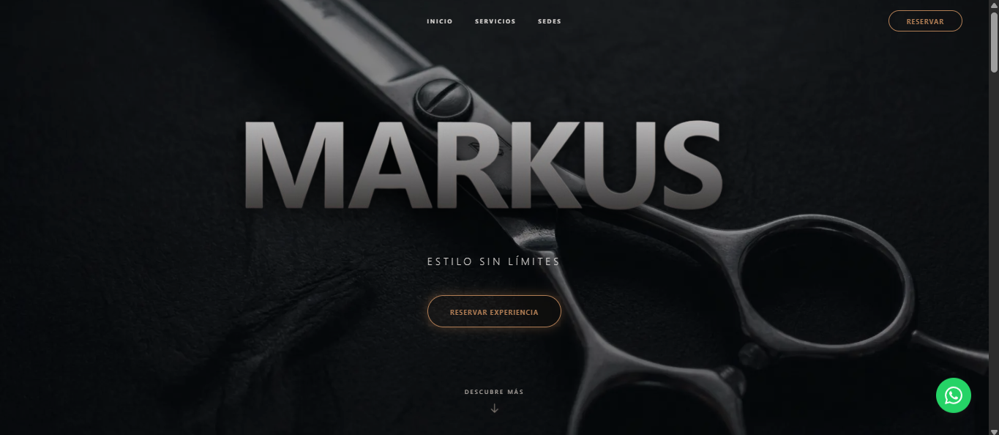
  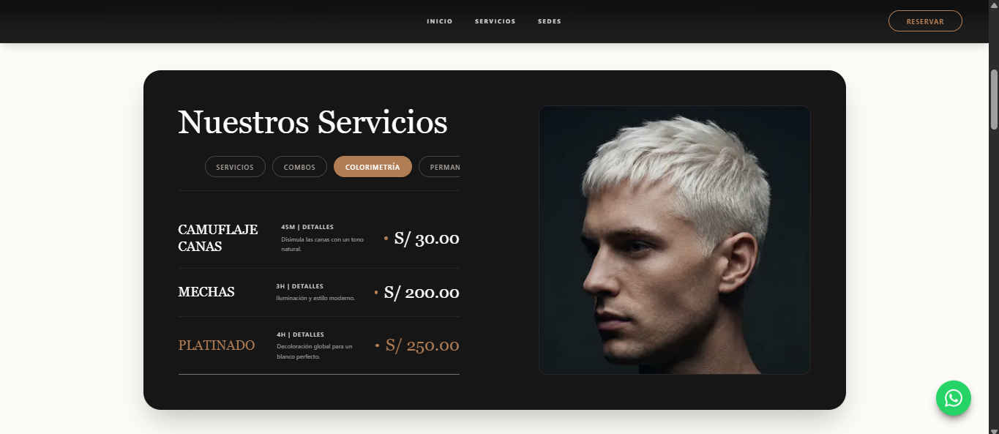
  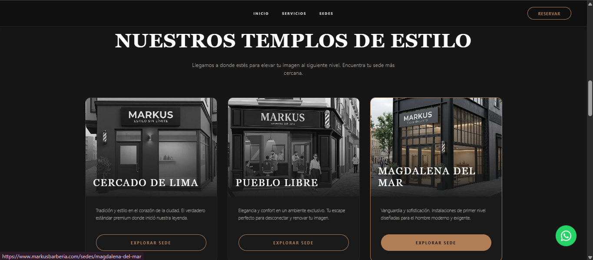

---

## ⚙️ 2. Panel Administrativo (Back-office B2B)

El núcleo operativo del negocio. Un dashboard seguro y reactivo diseñado para que la recepción y administración tengan control total sin margen de error.

* **Aislamiento por Sedes (Multi-Tenant):** Así como se observa en las capturas el panel de la sede "Pueblo Libre", la arquitectura del sistema garantiza que **cada una de las 3 sedes cuente con su propio entorno independiente**. La información, citas, métricas y barberos están estrictamente aislados según el local, asegurando una gestión limpia y sin cruce de datos entre sucursales.
* **Seguridad Blindada:** Acceso restringido mediante **Middleware de Next.js** (redirección si no hay sesión) y políticas **RLS** en la base de datos para evitar consultas no autorizadas.
* **Sincronización en Tiempo Real:** Integración de *Supabase Realtime*. Cuando un cliente reserva desde su celular, el panel de la recepcionista se actualiza instantáneamente sin necesidad de recargar la página.
* **Manifiesto Diario y Filtros:** Vista de agenda por barbero, por sede y por estado de la cita (Pendiente, Atendido, Cancelado), facilitando el flujo de trabajo diario.
* **Edición y Reasignación Inteligente:** Al reprogramar una cita o agregar servicios extra desde el panel, el sistema vuelve a validar la disponibilidad para evitar cruces con citas futuras.
* **Gestión Multinivel:** Control de métricas, cobros y administración de los barberos en cada una de las 3 locaciones físicas.

 

  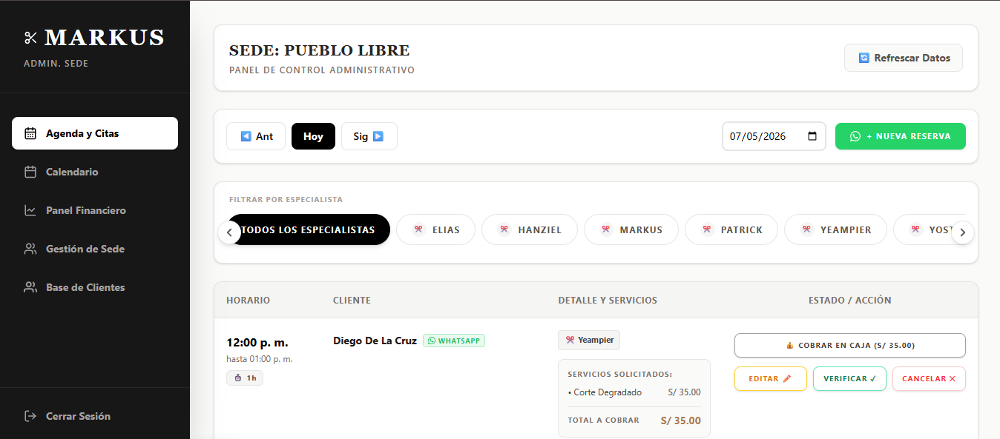
  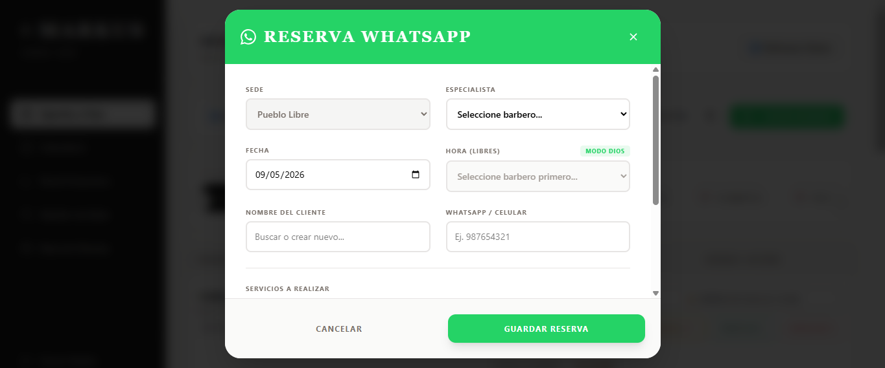  
  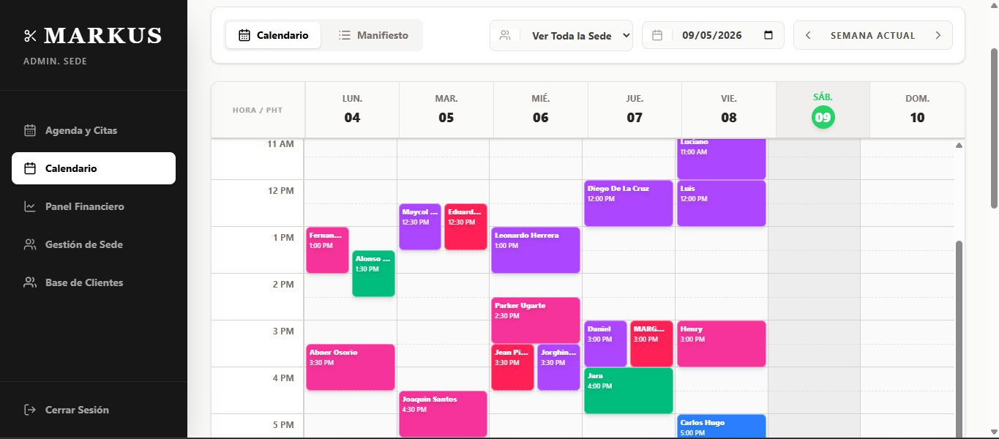
  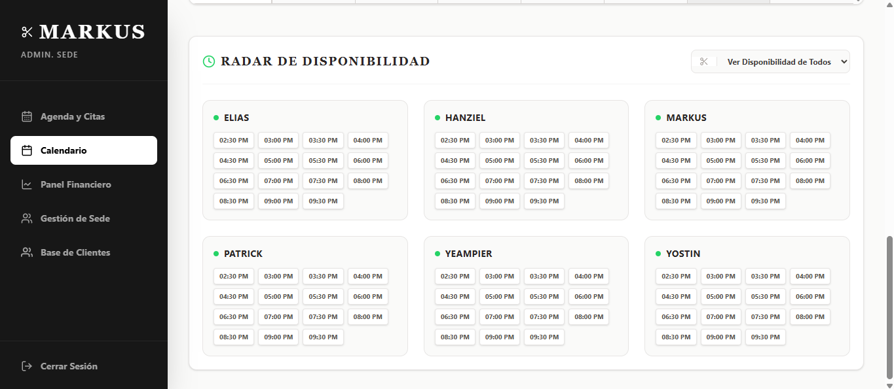  
  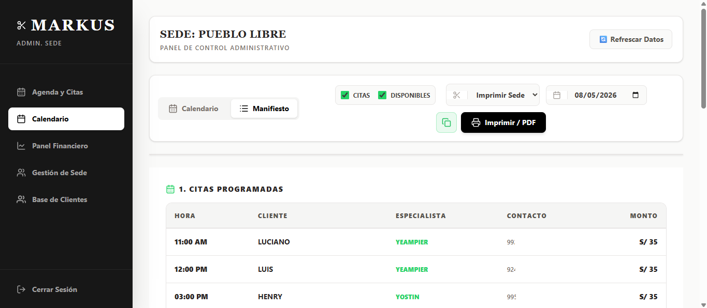
  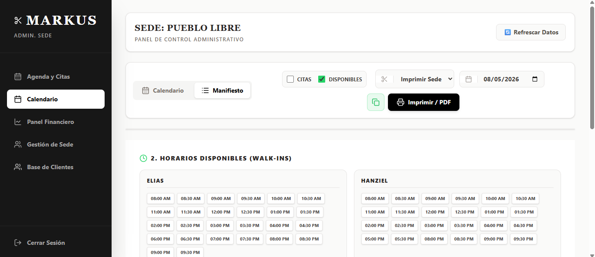  
  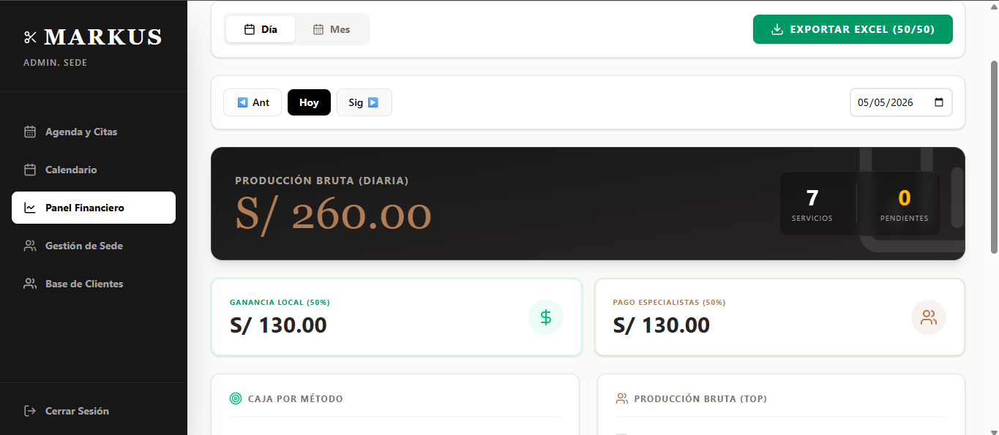
  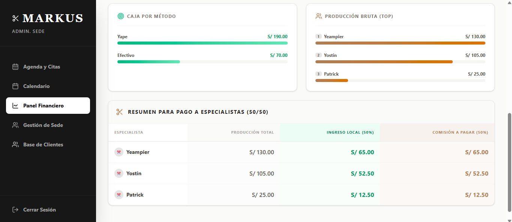  
  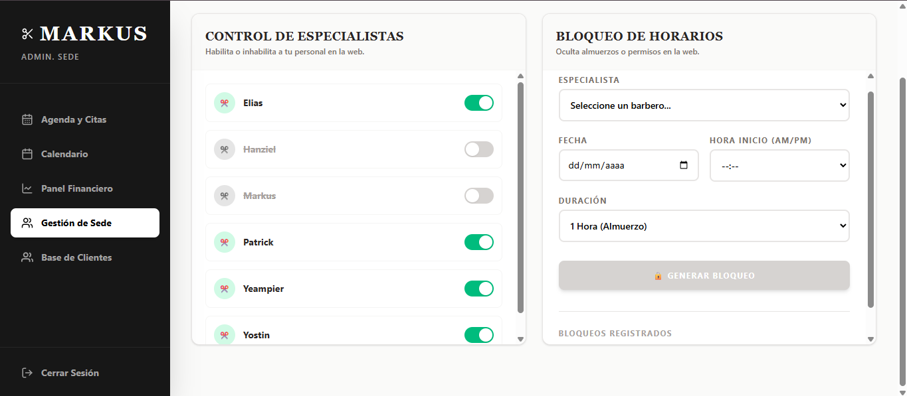
  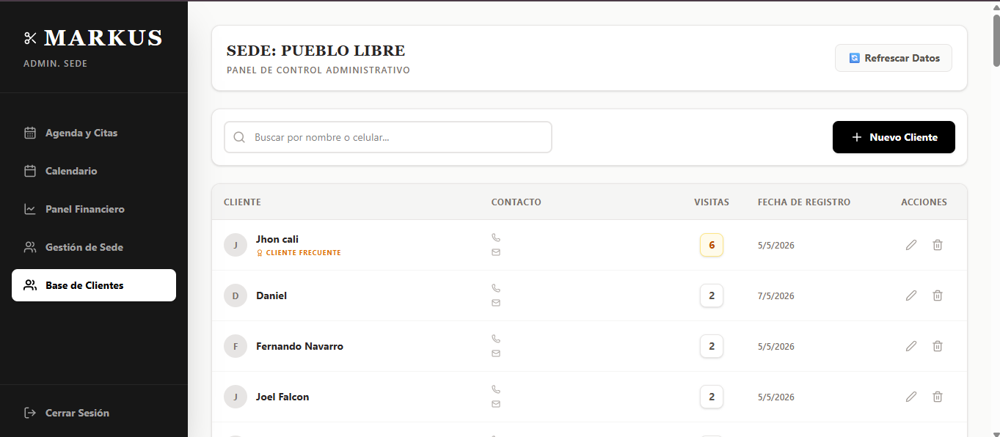

---

## 🧠 Retos Técnicos Superados

1. **Gestión de Zonas Horarias (Timezones):** Manejo estricto del tiempo en UTC desde el backend y conversión a la hora local (`America/Lima`) en el frontend para evitar que las citas se guarden en días equivocados.
2. **Motor de Prevención de Colisiones:** Desarrollo de un algoritmo que bloquea espacios de tiempo exactos en la base de datos, considerando el tiempo de inicio y fin (dinámico) de cada conjunto de servicios.
3. **Concurrencia de Datos:** Evitar que dos clientes reserven el mismo espacio exacto al mismo tiempo mediante bloqueos optimistas en PostgreSQL.

---

## 👨‍💻 Autor

**Jhon Patrick Cali**
*Software Engineer | Full-Stack Developer*
* Desarrollado para: **Markus Barbería**
* Agencia: **Z-Index Studio**
